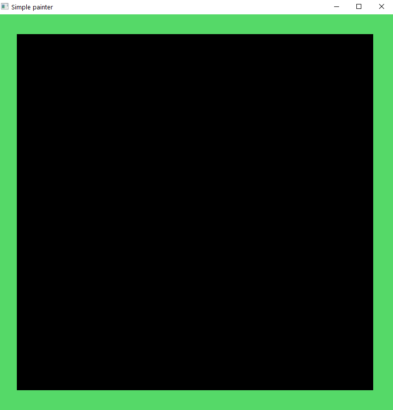
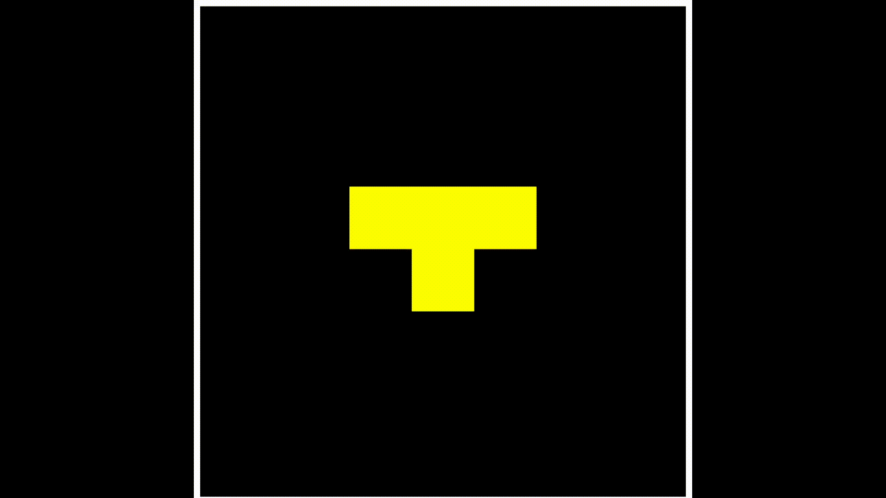

## SEC-Lab-3
### The third Lab of Software Engineering Components
---

### Contributors:
- Danil Yaremenko danilyaremenko@gmail.com
- Nikita Petrykin n.petrykin.im12@kpi.ua
- Yurii Grygorash gyv220427@gmail.com
- Yan Petrov yanemerald2004@gmail.com


### How to use:
1. Open terminal & clone repo to your pc:
```bash
git clone https://github.com/nikitosikvn1/SEC-Lab-3.git
```
2. Go to your local repo directory:
```bash
cd SEC-Lab-3/
```
3. Run local:
```bash
go run cmd/painter/main.go
```
4. Run SEC-Lab-3\script\index.html in your browser 

5. Use the buttons or write a request to the HTTP server. For example:
```
white
update
```
Background will be white.

### **List of commands:**

1. **white** <br>
    - Will paint backgound in white <br>
2. **green** <br>
    - Will paint backgound in green <br>
3. **update** <br>
    - Will update content in main.exe.<br>
4. **bgrect x1 y1 x2 y2** <br>
    - Will paint a black rectangle  on backgound  in coordinates A(x1*800;y1*800) B(x2*800;y2*800). Only the last requested rectangle will be displayed.<br>
5. **figure x y** <br>
    - Will paint figure "T" with center in coordinates "x y" above the background.<br>
6. **move x y** <br>
    - Will add/subtract the figures centers coordinates.<br>
7. **reset** <br>
    - Cleans information about backround and all added objects created with "figure" and "bgrect". And fills the backround in black.

## Results of the clicking on the buttons:
<p style="text-align: center;">First button</p>
<br>



<br>
<p style="text-align: center;">Second button</p>
<br>

