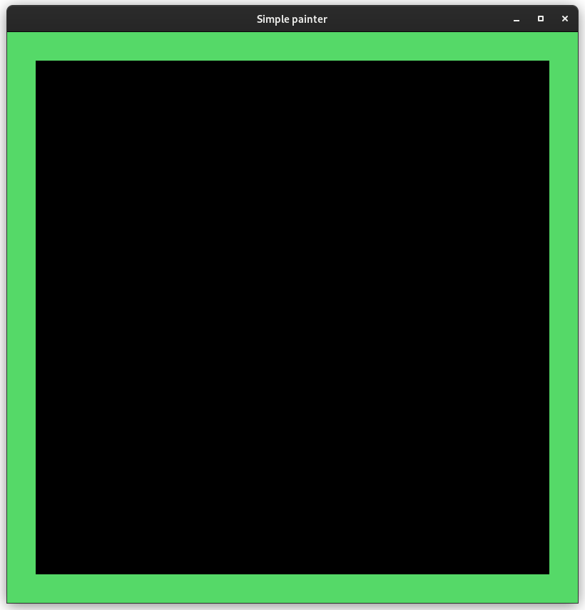
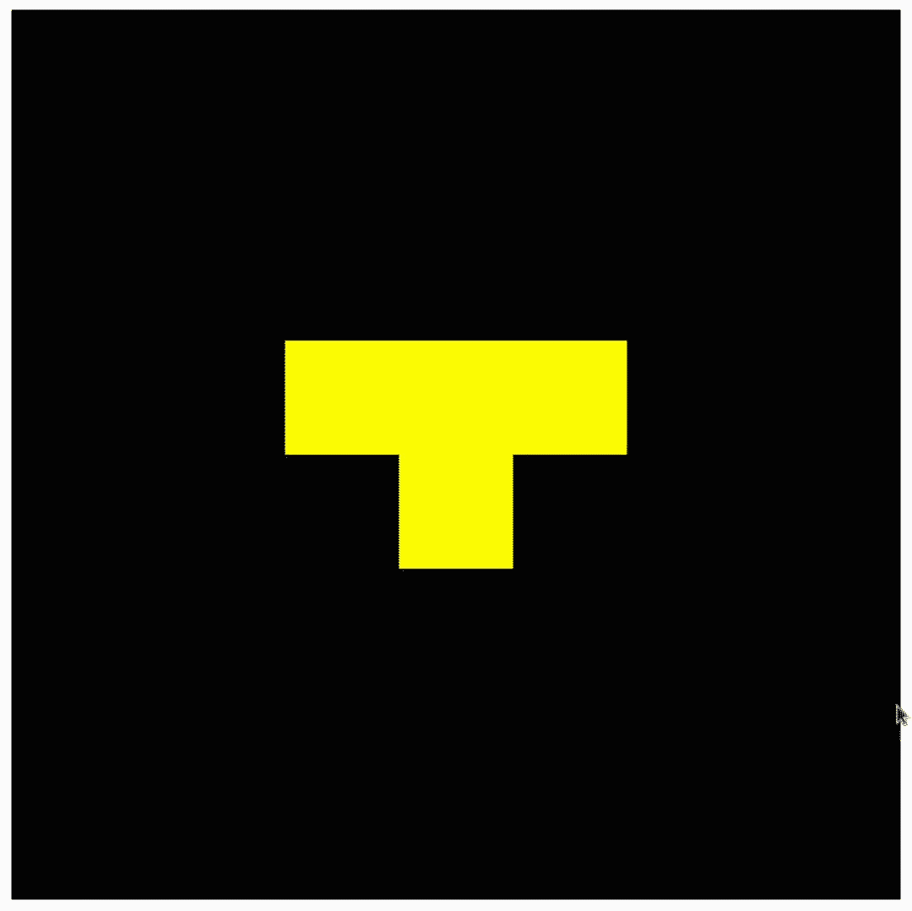
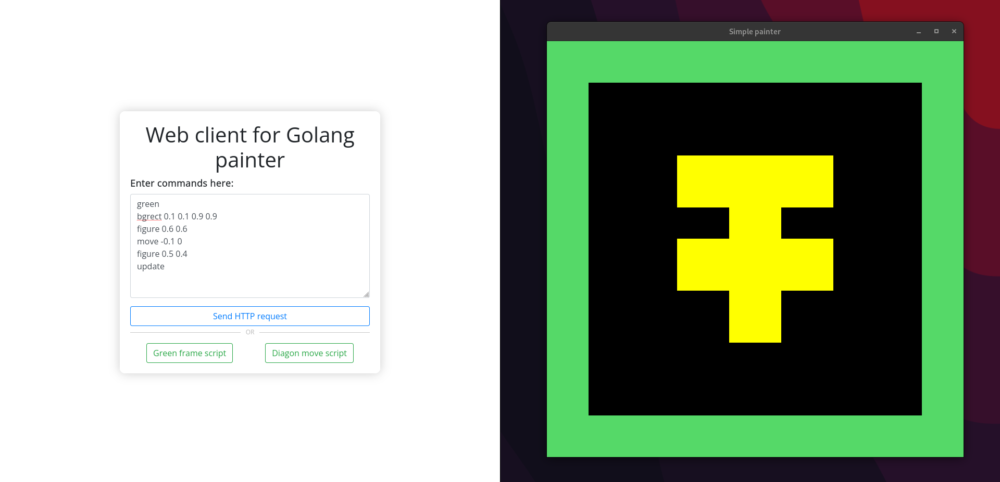

## SEC-Lab-3
### The third Lab of Software Engineering Components
---

### Contributors:
- Danil Yaremenko danilyaremenko@gmail.com
- Nikita Petrykin n.petrykin.im12@kpi.ua
- Yurii Grygorash gyv220427@gmail.com
- Yan Petrov yanemerald2004@gmail.com


### How to use:
1. Open terminal & clone repo to your pc:
```bash
$ git clone https://github.com/nikitosikvn1/SEC-Lab-3.git
```
2. Go to your local repo directory:
```bash
$ cd SEC-Lab-3/
```
3. Run local:
```bash
$ go run cmd/painter/main.go
```
4. Open the SEC-Lab-3\script\index.html page in your browser 

5. Use ready-made scripts or write commands manually to control the graphics window.  
For example:
```
white
update
```
This script will fill the background with white color.  

### **List of commands:**

1. **white**
    - Fills the background with white color.  
2. **green**
    - Fills the background with green color.  
3. **update**
    - Updates content in graphics window.  
4. **bgrect x1 y1 x2 y2**
    - Draws a black rectangle over the backgound at the given coordinates (Upper left and lower right corners). Only the last requested rectangle will be displayed.  
5. **figure x y**
    - Draws a "T" figure centered at coordinates (x;y) over the background.  
6. **move x y**
    - Moves the object horizontally by X, and vertically by Y.  
7. **reset**
    - Cleans information about backround and all added objects created with "figure" and "bgrect". And fills the backround in black.  

## Ready scripts
1. **Green border**  
Contains the following commands:  
```
green
bgrect 0.05 0.05 0.95 0.95
update
```
Result:  
  

2. **Diagonal movement of the figure**  
Contains the following commands (1st request):  
```
white
figure 0.1 0.1
update
```
2nd request (Sent every second, 9 times in total):  
```
move 0.1 0.1
update
```
Result:  


## Custom scripts
You can also write your own scripts to control the graphics window:  
